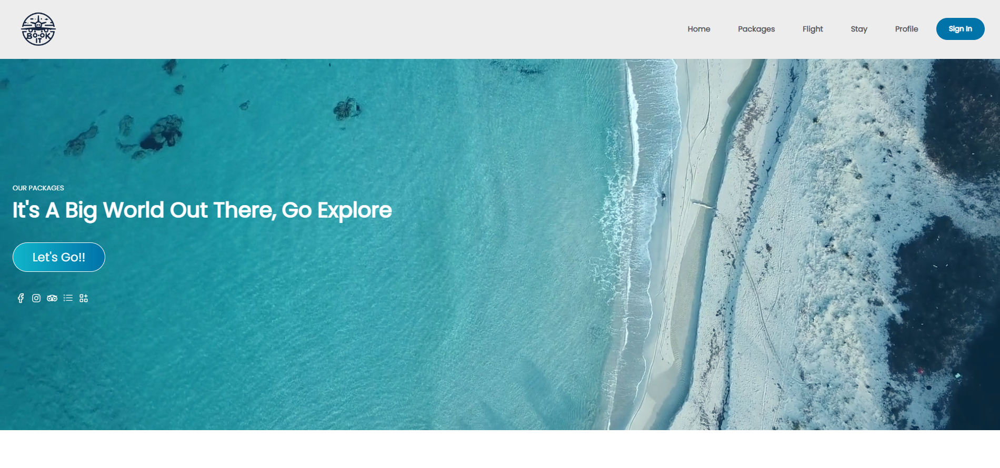

# Book It Travel Application

The Book It Travel Application was developed as a minimalist user friendly travel booking application.  The focus was for users to be able to book flights and hotels from a curated list for anywhere in the world.

## Table of Contents

1. About The Project
2. Getting Started
3. Usage
4. Contributing
5. License
6. Contact
7. Deployed URL
8. Acknowledgements

## About The Project



This project is a single page application built with JavaScript, React, Redux, Node Cache, Node.js, Express.js, Amadeus API, and Stripe.

### Built With

* JavaScript
* React
* Redux
* Node Cache
* Node.js
* Express.js
* Amadeus API
* Stripe

## Getting Started

This is a basic guide on how to set up the project locally on your machine.

### Prerequisites

Before you begin, ensure you have met the following requirements:

* You have installed the latest version of Node.js and npm.
* You have a Windows/Linux/Mac machine.

### Installation

1. Clone the Repository
   First, you need to clone the repository to your local machine. You can do this with the following command:
   ```sh
   git clone https://github.com/BookItTravel/Capstone.2310.git

2. Install NPM Packages
    Navigate into the cloned repository and install the necessary NPM packages:
    ```sh
    cd Capstone.2310.project
    npm install

3. Set Up Environment Variables
    Navigate into the cloned repository backend.
    ```sh
    cd backend
    ```
    Create a .env file in the root directory of the project. Update the .env file with your API keys, tokens, passowrds, and database URL.
    ```sh
    CLIENT_ID = YOUR_AMADEUS_API_KEY
    CLIENT_SECRET = YOUR_AMADEUS_API_CLIENT_SECRET
    DATABASE_URL
    JWT_SECRET
    STRIPE_ID = YOUR_STRIPE_KEY

4. Start the Development Server
    Now you can start the development server and begin contributing:
    ```sh
    npm run dev
    ```
    Now you should be able to see the project running on localhost:3000 on your web browser.

    Navigate back to the project level:
    ```sh
    cd ..
    ```
    Now you can start the frontend in your browswer and begin contributing:
    ```sh
    npm run dev

### Usage


1. Click the button on the landing page to navigate to the search form.
2. Enter vacation information into the search form and click the search button.


3. Departure flights are provided for you to select from. Click the flight you want.
4. Next return flights are provided for you to select from. Click the flight you want.
5. Next your hotel choices are provided.  Click the hotel you want.
6. If there is a room available, a window will appear for you to select your room.


7. Navigate to the Booking page to review your trip.


8. If all looks good, continue to the next page to enter your information and any other travelers that might be traveling with you.
9. Enter payment information into the Stripe form.


10. Review the confirmation page to get your Confirmation Number and book your next trip.

### Contributing

Contributions are what make the open source community such an amazing place to learn, inspire, and create.  Any contributions you make are greatly appreciated.

### License

Distributed under the MIT License. See LICENSE for more information.

### Contact

- Matthew Brown
- Jon Hinson
- Lilianne Tavarez
- Portia Williams

### Deployed URL
https://travelapp-3da1f049e629.herokuapp.com/

### Acknowledgements

A big thank you for all the hard work from the team.  We wouldn't have been able to pull this off if it wasn't for the work each member put in.

- Jon Hinson - Front End and Design Superstar
- Portia Williams - Front End and Redux Savant
- Lilianne Tavarez - Back End and API Whisperer
- Matthew Brown - Jack of All Trades